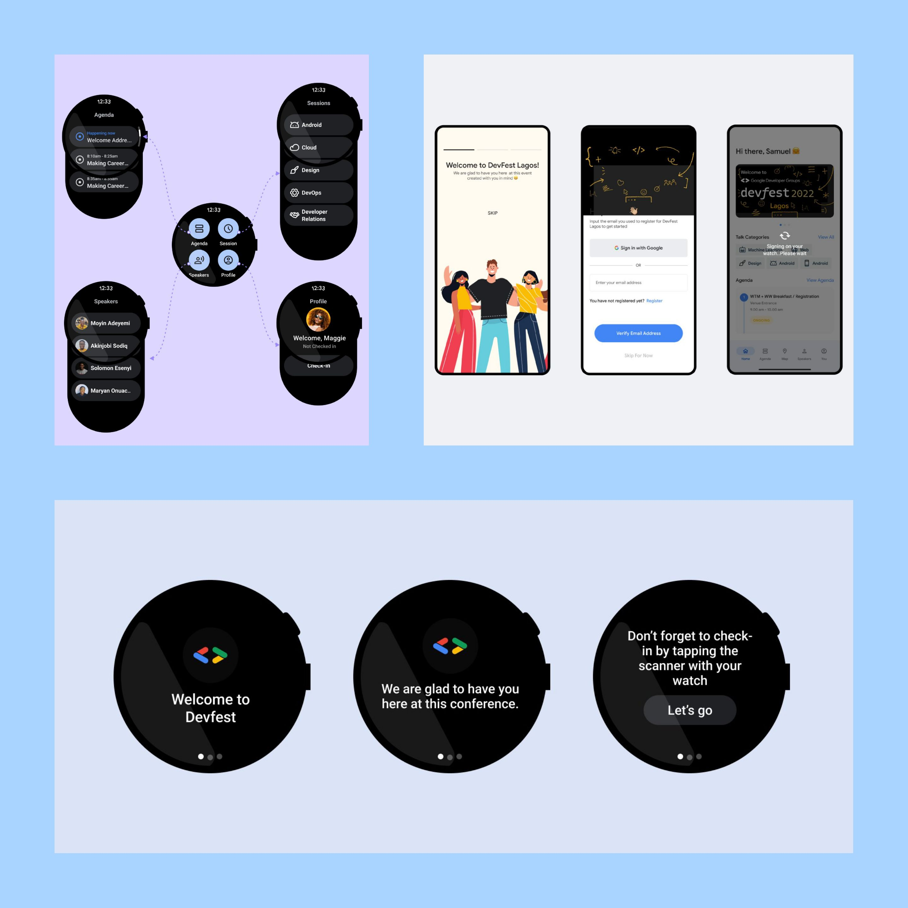

<a href="https://www.figma.com/file/y8xymmhonOeNQBj7P9Dfll?node-id=109:4533&comments-enabled=1&viewer=1" target="_blank" rel="nofollow noopener noreferrer" aria-label="Figma Link"> <u>Figma Link</u> </a> 
<a href="https://www.figma.com/file/y8xymmhonOeNQBj7P9Dfll/Devfest-Wearable-App?type=design&t=lfuIwUIEFoWmH1li-6" target="_blank" rel="nofollow noopener noreferrer" aria-label="Case Study"> <u>Case Study</u> </a>

# Devfesttttt
We made a Wear Os version of the DevFest App we saw at DevFest 2022. And in case you're wondering, it's Devfesttttt (with 5 t). 
<a href="https://twitter.com/ZeezCrypto" target="_blank" rel="nofollow noopener noreferrer" aria-label="Adeleke Azeez"> <u>Adeleke Azeez</u> </a> did the Case Study and Figma Designs and <a href="https://twitter.com/FemiOkedeyi" target="_blank" rel="nofollow noopener noreferrer" aria-label="My Twitter"> <u>I did</u> </a> the Wear and Android Apps.

 ---
 
 ##  Before you run
To use the sign-in with Google feature in the phone module, first open the local.properties file and paste your WEB_CLIENT_ID for your Google account.
i.e WEB_CLIENT_ID="PASTE_YOUR_KEY_HERE"

 ---
 
 ##  Now for the development, I used:
 
 * Jetpack Compose for building the UI
 * Room Database for well, the databases
 * Dagger-Hilt for dependency injection
 * Google's One Tap Client Client to log in and get the profile picture, email, and name from your phone
 * Wear's CapabilityClient APIs i.e MessageClient to start the wear activity from your phone (because you can) and DataClient for sending your profile picture, email, and name to the paired Wear device (Shoutout to github.com/android/wear-os-samples)

---

##  License
[Apache License](LICENSE)
